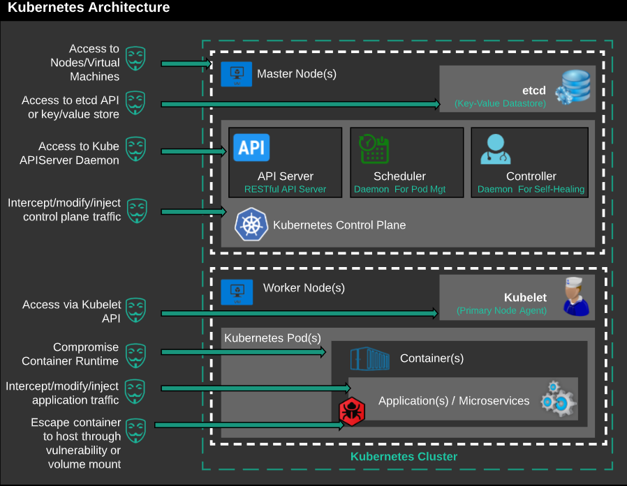

### Kubernetes is not secure by default!

An attacker won't look at your cluster as a list of resources, but as a graph. They will try and discover what dependencies exist within your cluster and how to best use this.

Bellow I have listed a few Kubernetes attack vectors I have come across. An **attack vector** is a path by means a hacker can gain access to a computer or network server in order to deliver a payload or malicious outcome. Attack vectors enable hackers to exploit system vulnerabilities, including the human element.

#### Access to Nodes and Virtual Machines

Since Kubernetes nodes are bare-metal or virtual hosts, hackers mat use point of entry to the host, such as ports open for shell access, to gain control of the system. Once inside, the attacker may inject malicious code and other vulnerabilities that would be used to further compromise this system and others on the network as well as siphon off data and other cyber assets.

Secure shell on a secure port, requiring authentication and employing access keys is needed to prevent this form of intrusion.

#### Access to etcd API or key/value store

The etcd system, is a separate module used by Kubernetes to store configuration and state information on all Kubernetes components. Metadata used to understand labels and other component identifiers is also stored in etcd.

The manner through which Kubernetes components utilize etcd resources is through an etcd API. The API is called to store and retrieve values at configuration and runtime. In most cases, the etcd processes are run on a private network or within a virtual private cloud. Even so, it is important to secure the API with certificates to ensure that interprocess communication is only performed by authorized agents.

#### Access to Kubernetes API Server

The API server is the only Kubernetes component that should expose an API endpoint beyond the virtual private cluster network. While applications running in containers may expose end-points, the API server is the only Kubernetes component that can be accessed from client systems outside the cluster.

Typically the Kubectl utility is the client program making access to the API server. However Kubernetes supports a number of open-source libraries that provide a means for custom application to make REST calls to the API server. This is done to facilitate the extensibility of the Kubernetes system.

Kubernetes recommends that TLS(transport Layer Security) be implemented to protect the API server from unwanted intrusion. Kubernetes has its own means of authentication, authorization and admission control.

#### Escape container to host

- Breaking out of a container to host is more or less difficult depending on a number of factors:
- Kernel Vulnerabilities: Containers running on a host, share the same kernel as the host, so if there is an exploitable issue in the kernel, that may be used to break out of the container to the host.
- Bad Configuration: If a container that you have access to is running with –privileged, you are likely ot be able to get access to the underlying host.
- Mounted Filesystems : If a container you have amounts a filesystem, you can likely change items in that filesystem which could allow you to escalate privileges to the host.
- Mounted NEtwork Sockets

#### Access via Kubelet API

The kubelet is a very powerful module that communicated with the control planes API server and the container runtime. While the Kubelet's API is only exposed within the private cluster network, it is important to implement TLS security to prevent unwanted intrusion.

Autoscaling Kubernetes nodes was historically difficult as each node requires a TLS key to connect to the master, and baking secrets into images is not good practice. Kubelet TLS bootstrapping provides the ability for a new kubelet to create a certificate signing request so that certificates are generated at boot time.

#### Intercept/Inject Control Plane

Proficient hackers are apt at using inter-process-communications between components to siphon secrets or steal other digital assets.
While Kubernetes Control Plane components typically perform peer-peer conversations on a private network, they still require TLS security to prevent malfeasance.

Hackers who gain control of master nodes have been known to replace authentic Kubernetes modules with modules that contain malware and run without detection. Hardening servers, frequent upgrades and rotating credentials and certificates is required to maintain secure control plane for K8s.

#### Compromise Container Runtime.

The images run by container runtime should be scanned for vulnerabilities prior to being stored in a repo or trusted registry. Additionally, Kubernetes options may be implemented to require pulling new images upon each execution.

#### Intercept/Modify/Inject Application Traffic

Malware within applications and container images is the cyber attackers Trojan Horse.

To keep K8s clusters secure, it is necessary to ensure that applications are correctly isolated within their containers. Applications shouldn’t run with root privilege and the container runtime must be configured to prevent privilege escalation by application components.

Ports opened by the container at runtime must be limited. Volumes mapped to the container from the host environment should be limited and scanned to ensure workloads do not persist data that includes viruses or malware.
